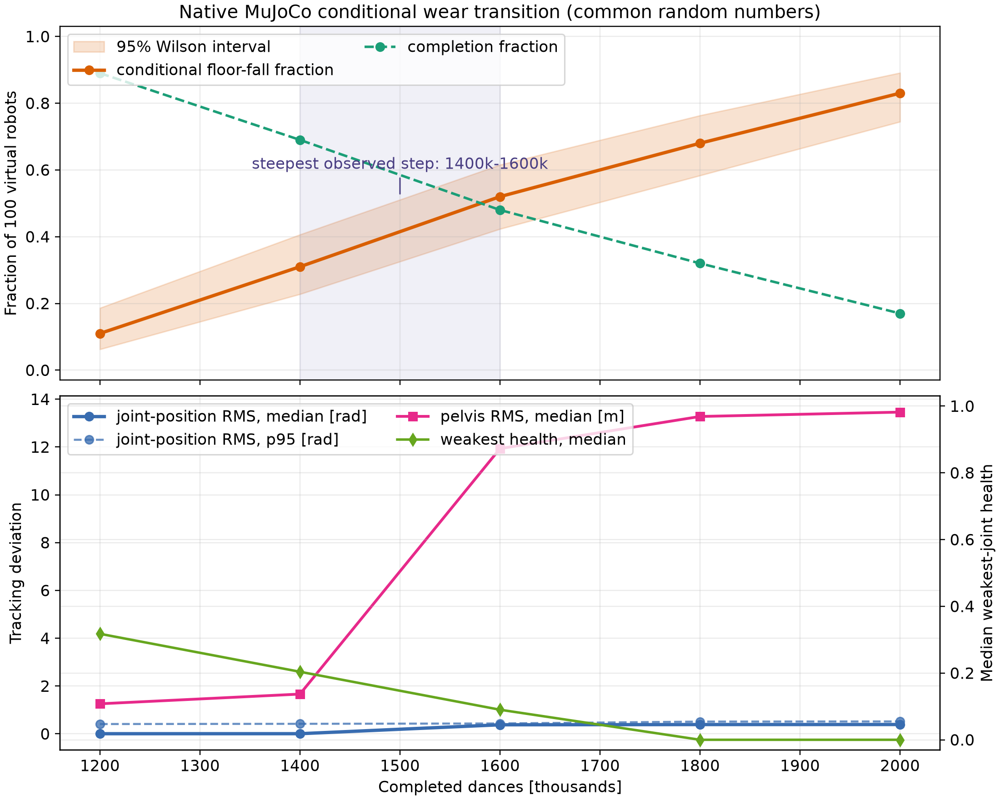
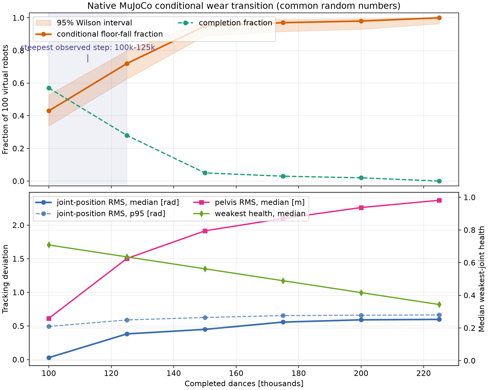
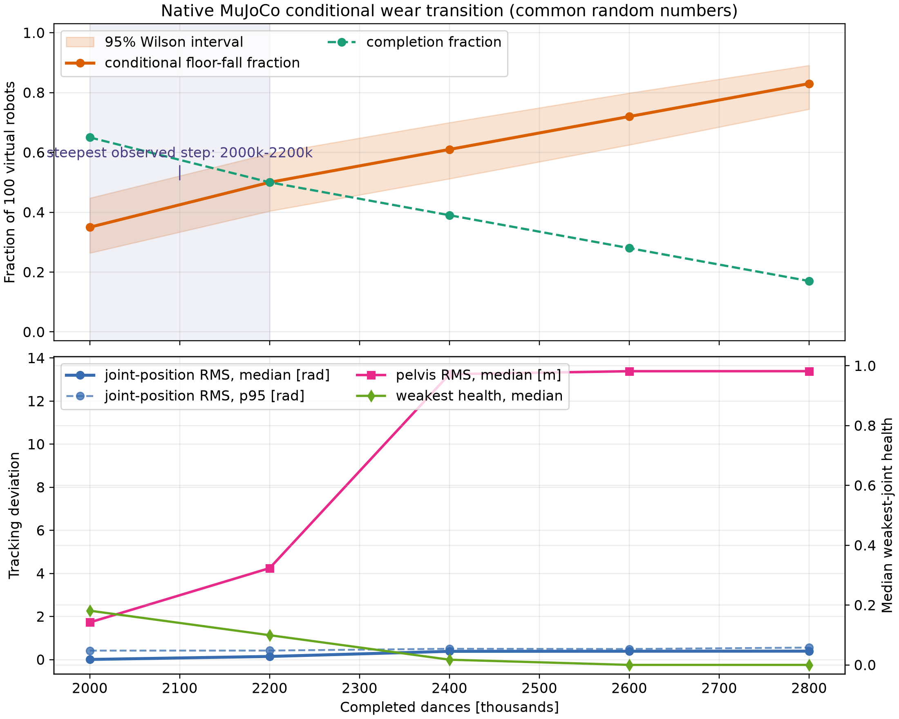
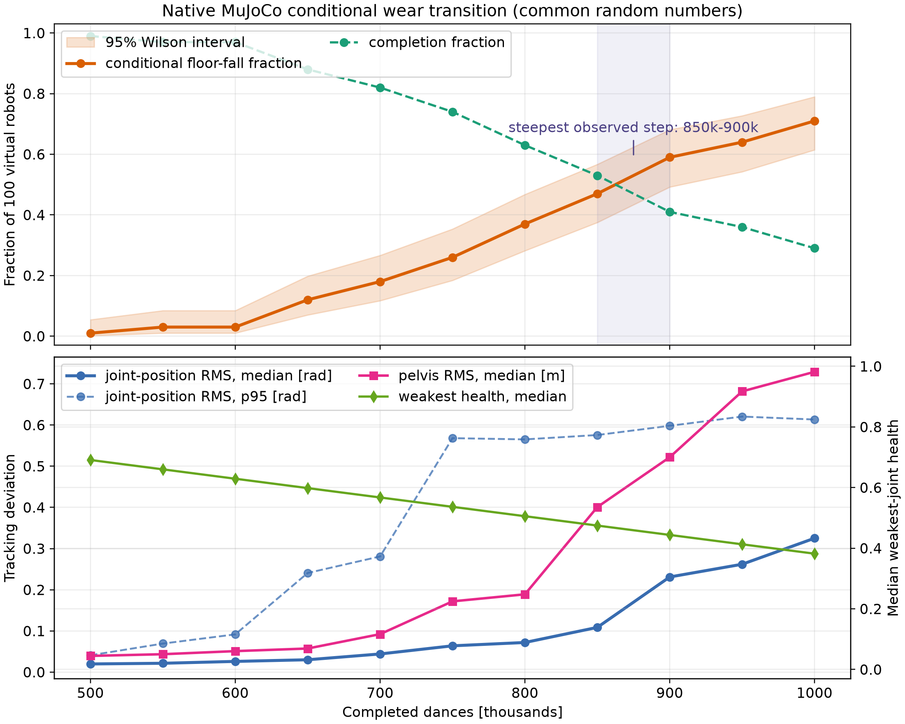
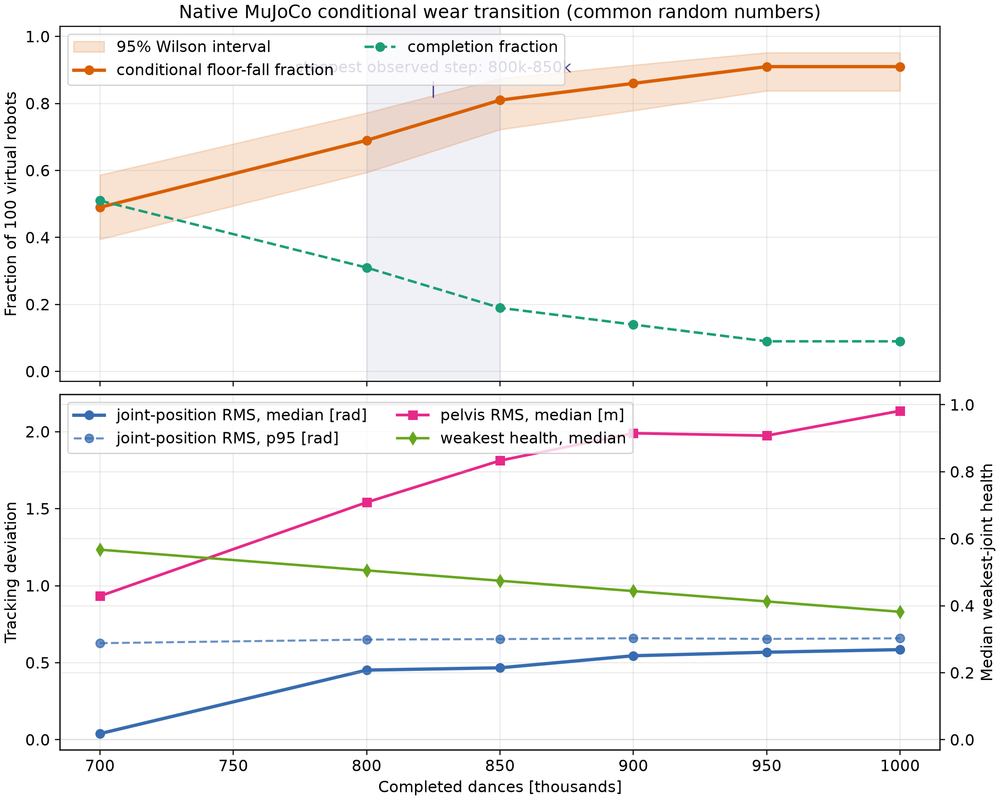
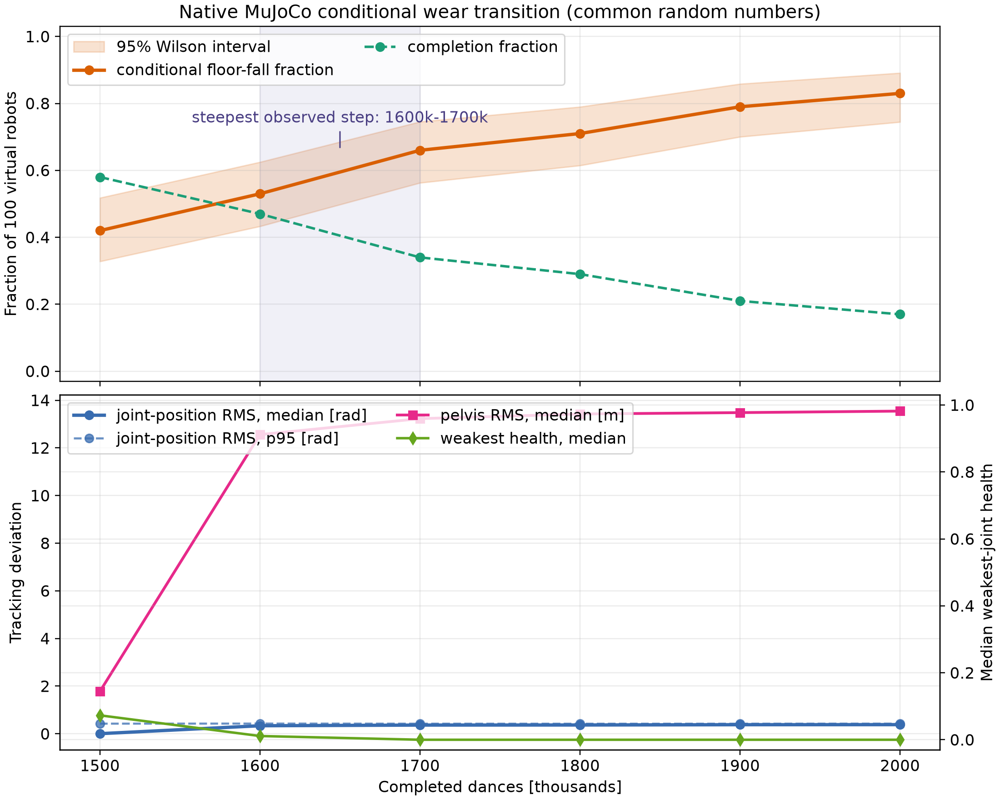

# Cross-Policy Wear Experiments

Updated: 2026-08-27.

## Scope

This note consolidates the current native-MuJoCo evidence for the Unitree G1
under three deployed policies:

1. short `RB+Y` dance clip, 16.24 s;
2. full `dance1_subject2`, 131.48 s;
3. Unitree velocity-walking policy at `vx=0.4 m/s`, 60 s.

The completed cross-policy curves are a **conditional simulator sensitivity analysis**, not a measured
physical lifetime or fleet failure probability for a real G1. The repetition
coordinate is a normalized accelerated-wear coordinate until calibrated using
real-robot or component-life data.

## Common Protocol

- Physics/control backend: native C MuJoCo, Unitree `scene_g1.xml`, 2 ms
  physics, 20 ms ONNX policy control.
- Every trial starts from the same exact initial pose and uses the deployed
  policy and matching `deploy.yaml` observation/action interface.
- Floor-level failure: pelvis below `0.45 m` **and** torso below `0.55 m` for
  at least `0.5 s`.
- Completed cross-policy sweep: all 29 actuators receive the same relative
  short-dance joint-load damage profile;
  health maps to available torque with floor `0.10` and exponent `1.5`.
- Population sensitivity: 100 virtual robots per wear checkpoint. Each gets a
  lognormal accelerated wear-rate multiplier, mean `1.0`, CV `0.25`.
- Common random numbers: virtual robot `i` retains its multiplier at every
  checkpoint. Changes across the curve are therefore due to wear coordinate,
  not re-sampling a new virtual population.
- Orange bands are 95% Wilson intervals for the conditional fraction of
  floor-level falls.

## Healthy Controls

Every reported sweep included a healthy exact-start gate: `100/100` completed
without floor-level falls. Additional direct healthy probes completed:

| Policy | Duration | Result |
| --- | ---: | --- |
| Short dance | 16.24 s | 100/100 completed |
| Full dance | 131.48 s | 100/100 completed in the full-dance sweep |
| Walk, `vx=0.4` | 60 s | 100/100 completed in the walk sweep |
| Walk, `vx=0.8` | 60 s | single direct healthy probe completed |

The full dance can transiently lower pelvis height to about `0.374 m` during
the choreography while torso remains about `0.673 m`; this is why a pelvis-only
threshold would create false falls for that motion.

## Results

## Critical Interpretation Boundary

The completed three curves answer only:

> How tolerant is each closed-loop skill to one common actuator-degradation pattern?

They do **not** answer which skill physically causes faster degradation per
execution. Reusing the short-dance profile means that full dance and walking
were evaluated with an externally imposed, identical degradation pattern.
Therefore the apparent ordering below must not be described as a measured
motion-induced wear ranking.

### Motion-Specific Load Profiles: Next Experiment

The required causal chain is:

`motion -> its own joint load -> its own degradation -> actuator capability -> functional failure`.

For each healthy native trace we now calculate
`S_j,m = integral(abs(tau_j(t) * qdot_j(t)) dt)`. Both the 29-joint shape and
the total `sum_j S_j,m` matter. The current reference alpha is scaled by the
ratio of total work-like proxy, rather than normalizing away the magnitude.

| Motion | Trace duration | Total work-like proxy | Relative to short-dance reference |
| --- | ---: | ---: | ---: |
| Full dance | 131.48 s | 21717.7 | 4.758x |
| Walk `vx=0.4` | 60.00 s | 3047.4 | 0.668x |

These are still accelerated proxy values, not calibrated physical wear rates.
They are, however, motion-specific and will be used by the next sweeps instead
of the common profile. The profiles are generated at
`outputs/experiments/motion_profiles/`.

### Motion-Induced Degradation Protocol (Running)

This is a separate experiment from the completed common-pattern curves.  It
answers the model-conditional question:

> Given this accelerated damage law, which deployed motion accumulates the
> most modeled actuator damage per execution, and when does that motion lose
> closed-loop function under its own damage profile?

For every motion `m`, a healthy native trace produces its own vector
`S_j,m = integral(abs(tau_j * qdot_j) dt)`.  At repetition `R`, virtual robot
`i` receives:

`health_j(R,i,m) = clip(1 - R * alpha_m * severity_norm_j,m * z_i, 0, 1)`.

`alpha_m` is proportional to `sum_j S_j,m`; `z_i` is a fixed lognormal
wear-rate multiplier for virtual robot `i` (mean 1.0, CV 0.25).  Available
torque is then `0.10 + 0.90 * health_j^1.5`.  The same 100 `z_i` values are
reused at every repetition checkpoint, so a curve compares the same virtual
population as damage grows.

The completed sweeps used fresh exact-start native processes at each
checkpoint:

| Motion | Checkpoints | Trials/checkpoint | Canonical output |
| --- | --- | ---: | --- |
| Full dance | 0, 100k, 125k, 150k, 175k, 200k, 225k | 100 | `outputs/experiments/motion_induced_full_dance/` |
| Walk `vx=0.4` | 0, 2.0M, 2.2M, 2.4M, 2.6M, 2.8M | 100 | `outputs/experiments/motion_induced_walk_vx04/` |

The repetition scales differ intentionally: their ranges follow each motion's
own modeled per-execution work. These results remain an uncalibrated
model-conditional sensitivity analysis until `kappa` is tied to real G1
actuator or fleet data.

### Motion-Induced Results

**Superseded mathematical version.** The figures and tables in this section
were generated with schema v3, which used total-work scaling after per-motion
max normalization. They are retained only as an audit trail and must not be
used in a manuscript. Schema v4 now implements the direct joint-wise law
`D_j,m(R) = R * kappa * S_j,m`; its replacement sweep is pending in
`outputs/experiments/motion_induced_*_global_kappa/`.

### Schema v4 Global-Kappa Results

Schema v4 uses one global accelerated work-to-damage coefficient,
`kappa = alpha_ref / max_j(S_j,ref)`. Thus the direct per-execution damage is
`delta_D_j,m = kappa * S_j,m`, independently for each actuator. This separates
the work accumulated by a motion from whether that work is concentrated in one
joint or distributed across several joints.



The completed v4 walking ensemble gives:

| Walking episodes, 60 s | Falls / 100 | Median weakest-joint health | Median weakest torque scale |
| ---: | ---: | ---: | ---: |
| 0 | 0 | 1.000 | 1.000 |
| 1.2M | 11 | 0.318 | 0.261 |
| 1.4M | 31 | 0.204 | 0.183 |
| 1.6M | 52 | 0.090 | 0.124 |
| 1.8M | 68 | 0.000 | 0.100 |
| 2.0M | 83 | 0.000 | 0.100 |

The conditional 50% transition lies between `1.4M` and `1.6M` walk episodes;
the steepest measured interval is `1.4M--1.6M`. This is an **uncalibrated
model-conditional** result, not a physical G1 lifetime estimate.

The full-dance v4 ensemble is still running under the same 100-member,
common-random-number protocol. Its completed checkpoints currently show
`0/100` falls at healthy, `47/100` at `125k`, `73/100` at `150k`, and `89/100`
at `175k`. Its final figure and table will replace this status paragraph only
after `200k` and `225k` finish.





| Full-dance executions | Falls / 100 | Median weakest-joint health | Median weakest torque scale |
| ---: | ---: | ---: | ---: |
| 0 | 0 | 1.000 | 1.000 |
| 100k | 43 | 0.708 | 0.636 |
| 125k | 72 | 0.635 | 0.556 |
| 150k | 95 | 0.562 | 0.480 |
| 175k | 97 | 0.489 | 0.408 |
| 200k | 98 | 0.416 | 0.342 |
| 225k | 100 | 0.343 | 0.281 |

| Walking episodes, 60 s | Falls / 100 | Median weakest-joint health | Median weakest torque scale |
| ---: | ---: | ---: | ---: |
| 0 | 0 | 1.000 | 1.000 |
| 2.0M | 35 | 0.181 | 0.169 |
| 2.2M | 50 | 0.099 | 0.128 |
| 2.4M | 61 | 0.017 | 0.102 |
| 2.6M | 72 | 0.000 | 0.100 |
| 2.8M | 83 | 0.000 | 0.100 |

Within this model, full dance reaches the conditional 50% fall transition
between `100k` and `125k` of its own executions; walking reaches it at about
`2.2M` 60-second episodes.  This is consistent with the motion traces: full
dance has `4.758x` the short-dance total work proxy, while walking has
`0.668x`, and the full-dance policy is also less tolerant to its resulting
joint-wise torque loss.  The result is therefore a **model-conditional
motion-induced ranking**, not evidence that a physical G1 will fail after
these counts.  Its numerical repetition scale is controlled by the uncalibrated
accelerated `alpha`; the robust finding here is the causal separation of each
motion's load pattern and magnitude from its functional tolerance.

### Short Dance: 16.24 s



| Completed dances | Falls / 100 |
| ---: | ---: |
| 500k | 1 |
| 550k | 3 |
| 600k | 3 |
| 650k | 12 |
| 700k | 18 |
| 750k | 26 |
| 800k | 37 |
| 850k | 47 |
| 900k | 59 |
| 950k | 64 |
| 1M | 71 |

The transition is broad, roughly `650k--950k`; the 50% crossing is between
`850k` and `900k`. Individual outcomes are not strictly monotone under
nonlinear closed-loop contacts, so this is an aggregate conditional curve, not
an irreversible per-robot damage threshold.

### Full Dance: 131.48 s



| Completed dances | Falls / 100 |
| ---: | ---: |
| 700k | 49 |
| 800k | 69 |
| 850k | 81 |
| 900k | 86 |
| 950k | 91 |
| 1M | 91 |

The full dance is the least robust of the tested policies. Its aggregate 50%
crossing is immediately above `700k`; the largest observed increment is from
`800k` to `850k`.

### Walking: `vx=0.4 m/s`, 60 s



| Completed dances | Falls / 100 |
| ---: | ---: |
| 1.5M | 42 |
| 1.6M | 53 |
| 1.7M | 66 |
| 1.8M | 71 |
| 1.9M | 79 |
| 2.0M | 83 |

Walking is substantially more robust under this particular wear mapping. Its
50% crossing lies between `1.5M` and `1.6M`; the largest observed increment is
from `1.6M` to `1.7M`.

## Completed Common-Pattern Interpretation

Under the completed common-pattern assumption, the approximate ordering of
**tolerance to that common pattern** is:

`full dance < short dance < walk vx=0.4`.

This is a useful policy-level result: the same per-joint torque degradation
produces different failure transitions depending on the closed-loop task. It
does **not** establish that full dance accumulates wear faster than walking,
nor that a physical G1 will fail at these repetition counts.

The RMS panels include frames after a robot has fallen, so their large values
quantify total trajectory loss rather than pre-fall tracking quality. A useful
next analysis is a pre-fall-only trajectory-error curve and a time-to-first-fall
distribution per checkpoint.

## Reproducibility and Artifacts

Canonical generated experiment directories:

- `outputs/experiments/full_dance_transition/`
- `outputs/experiments/walk_vx04_transition/`
- `mvp_mujoco/outputs/rb_y_16s/native_health_transition_500k_1m/`

Each contains `summary.json`, `summary.csv`, detailed per-trial CSV files and
raw `.npz` traces. Raw output is excluded from Git due to size; the three
summary figures above are versioned in `docs/figures/`.

Relevant runners:

```bash
# Dense sweep engine
./dance_sim/.venv/bin/python mvp_mujoco/scripts/15_run_native_health_sweep.py --help

# Native policies
./dance_sim/run_native_mujoco_deploy.sh --help
./dance_sim/run_native_mujoco_velocity.sh --help

# Plot a completed sweep
MPLBACKEND=Agg ./dance_sim/.venv/bin/python \
  mvp_mujoco/scripts/17_plot_native_health_transition.py \
  --input outputs/experiments/walk_vx04_transition/summary.json
```

Two illustrative local videos are available but intentionally not committed:

- `outputs/cross_policy_wear/full_dance_r1m_fall.mp4`
- `outputs/cross_policy_wear/walk_vx04_r2m_fall.mp4`
